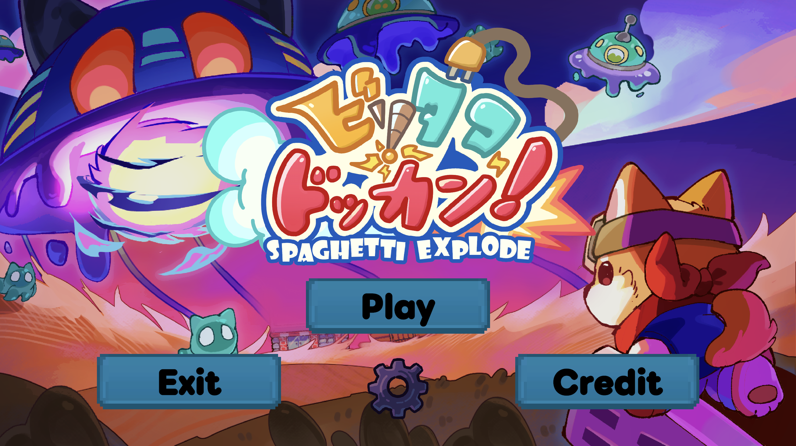
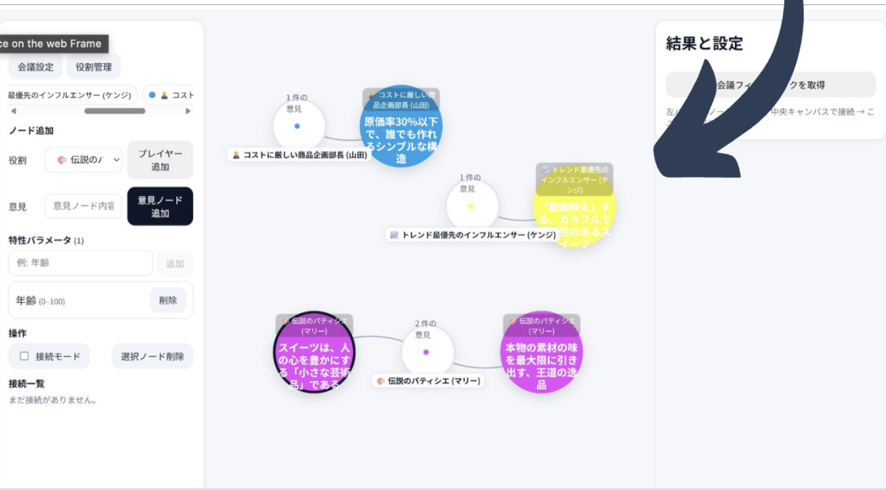

## Games
| 作品名 | 作品概要 | 使用技術 | リンク | 開発期間 | 概要 |
| ----- | ----- | ----- | ----- | ----- | ----- |
| [ビリダコドッカン](https://github.com/jaga-Nick/BSGJ_W-07) | タコ足配線で家具を爆発させる爽快なゲーム | Unity,C# | [ゲーム遊べます(itch.io)](https://bitsummit-gamejam.itch.io/spaghetti-explode) | 2025.04〜07 | [BSGJ2025](https://bitsummit-gamejam.itch.io/) |

## Works
| 作品名 | 作品概要 | 使用技術 | リンク | 開発期間 | 概要 |
| ----- | ----- | ----- | ----- | ----- | ----- |
| [AIdea canvas](https://github.com/uyuki234/KobeHackathon2025) | アイデアを図示化して、AIにまとめてもらえるアプリ | Python,React | - | 2025.09.03〜09.05 | 神戸ラボ主催 |
| [マッチングアプリ](https://github.com/hsmt-T/58hack) | 理系向けマッチングアプリ | React,JS | [作品概要(topaz)](https://topaz.dev/projects/60bd4e9822b607cafdff) | 2025.09.20〜09.21 | [58hack](https://58hackathon.connpass.com/event/362805/) |
| [隙マスター](https://github.com/jphacks/os_2519) | shortのような形式で学習ができるwebアプリ。[実際に動きます](https://sukima-knowledge.web.app/) | React,JS | [公開サイト](https://sukima-knowledge.web.app/) | 2025.10.19〜10.20 | [JPHACKS](https://jphacks.com/) |
